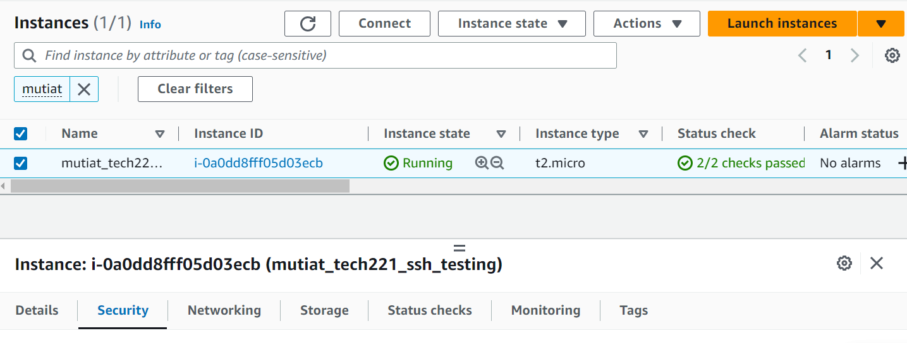

## How to connect to GitHub with SSH

There are two ways to connect your local respository to GitHub: HTTPS and SSH.

Below are the steps for SSH.

### 1. Create a .ssh folder

Open up your Git Bash App. Make sure you are in your Home directory. You can check this by typing the following command:

``` cd ~.```

Once in your home directory, check if you already have a .ssh folder, if not create one by using the following command:

```commandline
mkdir .ssh
```

### 2. Create your authentication key

You then need to go into the .ssh folder:

```commandline
cd .ssh
```

Once in the folder, type the following command to create your authentication key.

```
ssh-keygen -t rsa -b 4096 -C "<email address>"

```
Make sure you enter in your own email address. The above command will create public/private rsa key pair. When prompted to enter the file in which to save the key, type the following:

```commandline
<name>-github-key
```
Press enter when prompted to enter in your password. If your keys have been properly created you should see the following image.


### 3. Associate your SSH keys with GitHub accoun

Head over to github.com and login. Click on your profile, settings and on the lef-hand side click on "SSH and GPG Keys". Then click on "New SSH Keys"


You will be prompted to include a title and in box titled "Key" you need to insert your public key. To access your public key, head back to your Git Bash App. Type the following command to access the relevant file:

```commandline
cat <name>-github-key.pub
```
Copy the long public key from the file and paste it in the box on GitHub. Once done, click "Add Key"

### 4. Add agent and authentication

Type the following commands in your Git Bash App:

```commandline
eval ssh-agent -s
ssh-add <name>-github-key
ssh -T git@github.com
```

### Create repository 

When in your Git Bash App, go to the folder where you typically save files for your git repository. Then create a new folder in that folder.

Head over to Git Hub. Click on your profile, then "Repositories" and the click "New".

Give your repository a name and then scroll to the bottom of the page and click "Create Repository". 

Make sure you toggle to "SSH". Git Hub will then provide you will the relevant commands to be entered into your Git Bash App.
```commandline
echo "# test-ssh2" >> README.md
git init
git add README.md
git commit -m "first commit"
git branch -M main
git remote add origin git@github.com:<name of  file>.git
git push -u origin main
```

# How to set up an EC2 instance

Here are the steps to set up an EC2 instance on AWS.

1. Basic startup steps

First head over to the AWS Management Console and login.

In the search bar, type in EC2 and then select the EC2 option. 


Click on the 'Launch Instance' button and select 'Launch Instance'


2. Select the feature for your EC2 instance

First you input in a name for your EC2 instance


Then you select an AMI - chose ubuntu


Leave the instance type as t2.micro

Select a keypair - if you dont have one then create one.

Under 'Network Settings' makesure SSH traffic is from your specific IP address and select the checkbox to allow HTTp traffic from the internet.


Whilst in the 'Network Settings' section, click edit and ensure "Auto-assign IP" is set to enable.  


keep the other features as is for now and the click 'Launch Instance'.

3. Launch Instance

Once your ec2 instance has been intilized then select the check box and press connect. 


Make sure you're in the "SSH Client" tab and then head over to Git Bash App.

When in Git Bash, go to the folder where your .pem file is saved, then follow the instructions from aws.


# How to amend a security group in AWS

Once you have launched your EC2 instance with a security group you can, if like, amend the security group.

To do this, check the box for the instance. In the pannel underneath, navigate to the security tab.


Once on the security tab, click on the link to the security group.


Then click on "Edit Inbound Rules"


At this point you can add new inboud rules and/or delete rules. Once the necessary changes have been made, click on "Save Rules"


# Commonly used Linux commands

Here are a list of Linux commands

* ```ls``` - list all files in current directory 
* ```ls -a``` - hidden files
* ```whoami``` - tells you operating system
* ```pwd``` - tells you current location
* ```uname``` - gives us username: Linux
* ```uname -a```  - gives us all the information
* ```mkdir <name> ```- creates a directory
* ```cd ..``` - moves one directory back
* ```touch <filename>``` - create file
* ```nano <filename>``` - text editor
* ```cat <filename>``` - reveal content of file
* ```cp <filename> <where to go>``` - copy
* ```rm <filename>``` - delete file
* ```mv <filename> <folder>``` - cut and move file
* ```ll``` - shows permission of file
* ```top``` - list all the processes 
* ```Chmod 700 <filename>``` - changes the right of the owner to rwx 
* ```history``` - gives you the list of commands we used 
* ```rm -rf <name of file>``` - to remove file 
* ```head -1 <filename>``` - first line in file 
* ```tail -2 <filename>``` - last two file
* ```sort <filename> - sort out file name
* ps aux - shows all appliication processing 
* cat <filename> | grep <word> - search for word in file
* ls | tail -1 - list last file created
* ps aux | grep bash - process that are running using bash 
* sudo su - to use root user (to come out of it type exit)
* sudo apt update -y - downloads to new things
* sudo apt upgrade - switches to using the new things 
* sudo apt install nginx -y - installs nginx (which is a webserver)
* sudo systemctl status nginx - shows us current status of nginx
* sudo systemctl stop nginx - stops nginx 
* sudo systemctl stop nginx - starts nginx 
* sudo systemctl enable nginx  - everytime the system started it will run
* sudo nano <name of file> - to create a file

To automate the process: 
bash scripting - when file is created it should end with .sh
```
#!/bin/bash
# update
sudo apt update -y
# upgrade
sudo apt upgrade -y
# install Nginx
sudo apt install nginx -y
# restart Nginx
sudo systemctl restart nginx
# enable Nginx
sudo systemctl enable nginx
```
once script is run: sudo chmod +x <filename>
to run the script: sudo ./<name of file>
